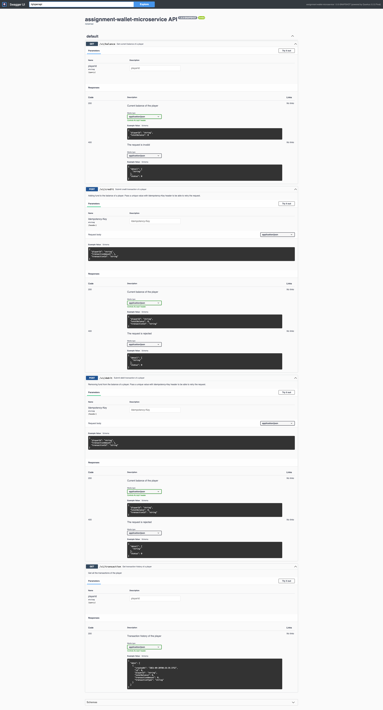

# Wallet Microservice

A simple wallet microservice. It does the following:
- Credit a player. Adding fund to the player account balance. 
    - The caller will supply a transaction id that must be unique for all transactions. 
    - If the transaction id is not unique, the operation must fail. 
- Debit a player. Removing fund from the player account balance.
    - The caller will supply a transaction id that must be unique for all transactions.
    - If the transaction id is not unique, the operation must fail.
    - The transaction will only succeed if there are sufficient funds on the account (balance - debit >= 0)
- Get current balance per player
- Get transaction history per player

## Implementation Details

- All functional requirements are implemented.
- `POST` operation on `/v1/credit` and `/v1/debit` endpoints is idempotent if given a unique value to `Idempotency-Key` header.
- Data is persisted to H2 database.
- Use property-based testing.
- Integrate Distributed Tracing technology, OpenTracing.
- Use flyway to manage database versioning.
- Validate with Hibernate Validator.

## How to run

Run the following command.

```shell
$ docker start jaeger 2>/dev/null || docker run --name jaeger -d -p 5775:5775/udp -p 6831:6831/udp -p 6832:6832/udp -p 5778:5778 -p 16686:16686 -p 14268:14268 jaegertracing/all-in-one:latest
$ ./mvnw compile quarkus:dev
```

Swagger UI will be available at http://localhost:8080/q/swagger-ui.
Jaeger UI will be available at http://localhost:16686.

If you have any problems, try cleaning with `./mvnw clean` command.

## How to test

Run the following command.

```shell
$ ./mvnw test
```

If you have any problems, try cleaning with `./mvnw clean` command.

## Swagger UI


